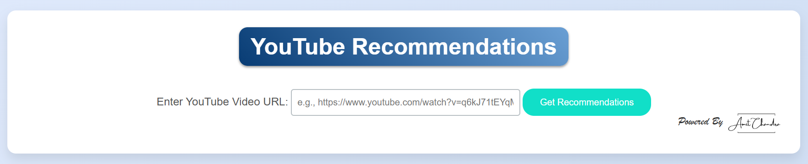

# YouTube Content Recommendation System

## 🎯 About the Project
This YouTube Content Recommendation System suggests related videos based on video metadata, content similarity, and machine learning techniques. Users can input a YouTube video URL, and the system provides recommendations to enhance content discovery.

## 🚀 Live Demo

Use the YouTube Content Recommendation System here:
[Live on Render](https://content-recommendation-system.onrender.com/)

## 🛠️ Tech Stack
- **Backend**: Flask (Python)
- **Frontend**: HTML, CSS, JavaScript
- **Machine Learning**: scikit-learn, NLP
- **API**: YouTube Data API
- **Deployment**: Render

## 🔄 How It Works
1. **User Input**: Enter a YouTube video URL.
2. **Extract Video Data**: The system fetches metadata using the YouTube Data API.
3. **Feature Processing**: NLP extracts meaningful tags and keywords from the video title and description.
4. **Similarity Matching**: The system finds related videos using a content similarity model.
5. **Recommendation Display**: The results are shown with similarity scores.

## 📌 Features
- Fetches video metadata from YouTube API
- Uses NLP for extracting key topics
- Computes similarity scores between videos
- Provides up to 25 recommended videos
- Live and hosted on Render

## 🔗 Connect with Me
- **Dev**: [Connect With Me On Dev](https://dev.to/amitchandra/)
- **LinkedIn**: [Connect With Me On LinkedIn](https://www.linkedin.com/in/connect-amit-chandra/)
- **Twitter**: [Connect With Me On X](https://x.com/CodeByAmit)

## 🏷️ Tags
`YouTube Recommendation` `Content-Based Filtering` `Machine Learning` `Flask API` `YouTube Data API` `NLP` `Video Recommendations` `AI Content Discovery`

---

⭐ If you find this useful, don't forget to share it!

